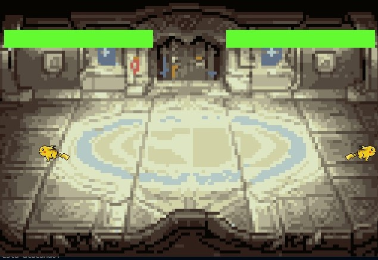

# Street Pikachu Game

## Descripción del Proyecto
Este proyecto es un juego de lucha inspirado en Street Fighter. El juego presenta a dos Pikachus que luchan por la herencia de la familia en un emocionante combate local para dos jugadores.

## Historia del Juego
En un mundo donde la electricidad es el poder supremo, dos Pikachus se enfrentan en una batalla épica por la herencia de la familia. El antiguo legado eléctrico está en juego, y solo uno puede prevalecer. ¿Quién emergerá como el verdadero heredero del poder y honor familiar?

## Manual de Usuario

### Cómo Jugar
1. **Inicio del Juego**: Ejecuta el archivo `./bin/main.exe`.
2. **Controles**:
   - **Jugador 1**:
     - **Moverse**: Usa las teclas `WASD`.
     - **Atacar**: Presiona la tecla `F`.
   - **Jugador 2**:
     - **Moverse**: Usa las `FLECHAS` .
     - **Atacar**: Presiona la tecla `L`.
3. **Objetivo**: Derrota al otro Pikachu para ganar la herencia.

## Manual para el Programador

### Cómo Compilar el Juego
1. **Clona el Repositorio**:
   `git clone https://github.com/23310396/st.git`
2. **Navega a la Carpeta del Proyecto**
    `cd st`
3. **Compila el Codigo**
    `make runmain`
4. **Ejecuta el Juego**
    `./bin/main.exe`
    
## Diagrama de Clases

## Imagenes de Muestra

